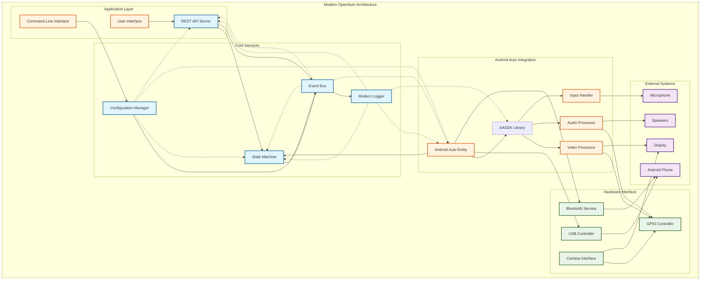

```mermaid
graph TB
    subgraph "Modern OpenAuto Architecture"
        
        subgraph "Application Layer"
            UI[User Interface]
            API[REST API Server]
            CLI[Command Line Interface]
        end
        
        subgraph "Core Services"
            SM[State Machine]
            EB[Event Bus]
            CM[Configuration Manager]
            LOG[Modern Logger]
        end
        
        subgraph "Android Auto Integration"
            AAE[Android Auto Entity]
            AASDK[AASDK Library]
            VID[Video Processor]
            AUD[Audio Processor]
            INP[Input Handler]
        end
        
        subgraph "Hardware Interface"
            USB[USB Controller]
            BT[Bluetooth Service]
            GPIO[GPIO Controller]
            CAM[Camera Interface]
        end
        
        subgraph "External Systems"
            PHONE[Android Phone]
            DISP[Display]
            SPKR[Speakers]
            MIC[Microphone]
        end
    end
    
    %% Application Layer Connections
    UI --> API
    API --> SM
    CLI --> CM
    
    %% Core Services Interconnections
    SM --> EB
    CM --> EB
    API --> EB
    EB --> LOG
    
    %% Android Auto Integration
    AAE --> SM
    AAE --> AASDK
    AASDK --> VID
    AASDK --> AUD
    AASDK --> INP
    
    %% Hardware Connections
    AAE --> USB
    AAE --> BT
    VID --> GPIO
    AUD --> GPIO
    CAM --> GPIO
    
    %% External System Connections
    USB --> PHONE
    VID --> DISP
    AUD --> SPKR
    INP --> MIC
    BT --> PHONE
    CAM --> DISP
    
    %% Event Flow
    EB -.-> SM
    EB -.-> AAE
    EB -.-> API
    
    %% Configuration Flow
    CM -.-> SM
    CM -.-> AAE
    CM -.-> API
    
    %% Logging Flow
    LOG -.-> SM
    LOG -.-> AAE
    LOG -.-> API
    LOG -.-> AASDK

    classDef modern fill:#e1f5fe,stroke:#01579b,stroke-width:2px
    classDef legacy fill:#fff3e0,stroke:#e65100,stroke-width:2px
    classDef external fill:#f3e5f5,stroke:#4a148c,stroke-width:2px
    classDef hardware fill:#e8f5e8,stroke:#1b5e20,stroke-width:2px
    
    class SM,EB,CM,LOG,API modern
    class UI,CLI,AAE,VID,AUD,INP legacy
    class PHONE,DISP,SPKR,MIC external
    class USB,BT,GPIO,CAM hardware
```
