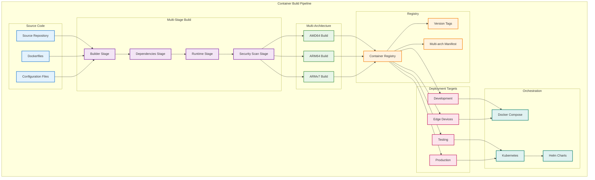

```mermaid
graph TD
    subgraph "Container Build Pipeline"
        
        subgraph "Source Code"
            SRC[Source Repository]
            DCK[Dockerfiles]
            CFG[Configuration Files]
        end
        
        subgraph "Multi-Stage Build"
            B1[Builder Stage]
            B2[Dependencies Stage]
            B3[Runtime Stage]
            B4[Security Scan Stage]
        end
        
        subgraph "Multi-Architecture"
            AMD[AMD64 Build]
            ARM[ARM64 Build]
            ARMV7[ARMv7 Build]
        end
        
        subgraph "Registry"
            REG[Container Registry]
            TAG[Version Tags]
            MAN[Multi-arch Manifest]
        end
        
        subgraph "Deployment Targets"
            DEV[Development]
            TEST[Testing]
            PROD[Production]
            EDGE[Edge Devices]
        end
        
        subgraph "Orchestration"
            DC[Docker Compose]
            K8S[Kubernetes]
            HELM[Helm Charts]
        end
    end
    
    %% Build Flow
    SRC --> B1
    DCK --> B1
    CFG --> B1
    
    B1 --> B2
    B2 --> B3
    B3 --> B4
    
    %% Multi-arch builds
    B4 --> AMD
    B4 --> ARM
    B4 --> ARMV7
    
    %% Registry operations
    AMD --> REG
    ARM --> REG
    ARMV7 --> REG
    REG --> TAG
    REG --> MAN
    
    %% Deployment flow
    REG --> DEV
    REG --> TEST
    REG --> PROD
    REG --> EDGE
    
    %% Orchestration
    DEV --> DC
    TEST --> K8S
    PROD --> K8S
    EDGE --> DC
    
    K8S --> HELM
    
    %% Build pipeline styling
    classDef source fill:#e3f2fd,stroke:#1976d2,stroke-width:2px
    classDef build fill:#f3e5f5,stroke:#7b1fa2,stroke-width:2px
    classDef multiarch fill:#e8f5e8,stroke:#388e3c,stroke-width:2px
    classDef registry fill:#fff3e0,stroke:#f57c00,stroke-width:2px
    classDef deployment fill:#fce4ec,stroke:#c2185b,stroke-width:2px
    classDef orchestration fill:#e0f2f1,stroke:#00796b,stroke-width:2px
    
    class SRC,DCK,CFG source
    class B1,B2,B3,B4 build
    class AMD,ARM,ARMV7 multiarch
    class REG,TAG,MAN registry
    class DEV,TEST,PROD,EDGE deployment
    class DC,K8S,HELM orchestration
```
