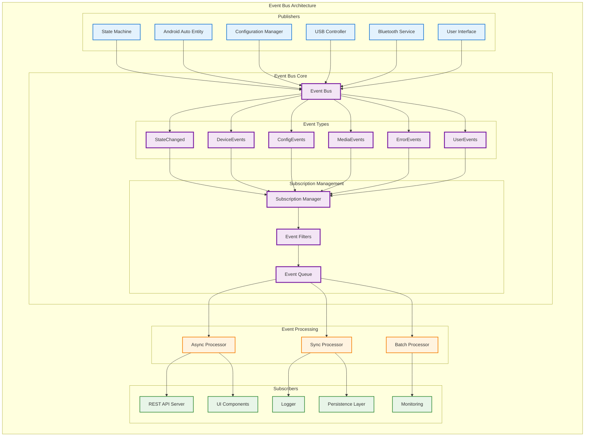

```mermaid
graph LR
    subgraph "Event Bus Architecture"
        
        subgraph "Publishers"
            SM[State Machine]
            AAE[Android Auto Entity]
            CM[Configuration Manager]
            USB[USB Controller]
            BT[Bluetooth Service]
            UI[User Interface]
        end
        
        subgraph "Event Bus Core"
            EB[Event Bus]
            subgraph "Event Types"
                ST[StateChanged]
                DEV[DeviceEvents]
                CFG[ConfigEvents]
                MED[MediaEvents]
                ERR[ErrorEvents]
                USR[UserEvents]
            end
            
            subgraph "Subscription Management"
                SUB[Subscription Manager]
                FILTER[Event Filters]
                QUEUE[Event Queue]
            end
        end
        
        subgraph "Subscribers"
            API[REST API Server]
            LOG[Logger]
            UI2[UI Components]
            MON[Monitoring]
            PERSIST[Persistence Layer]
        end
        
        subgraph "Event Processing"
            ASYNC[Async Processor]
            SYNC[Sync Processor]
            BATCH[Batch Processor]
        end
    end
    
    %% Publisher connections
    SM --> EB
    AAE --> EB
    CM --> EB
    USB --> EB
    BT --> EB
    UI --> EB
    
    %% Event Bus Internal
    EB --> ST
    EB --> DEV
    EB --> CFG
    EB --> MED
    EB --> ERR
    EB --> USR
    
    ST --> SUB
    DEV --> SUB
    CFG --> SUB
    MED --> SUB
    ERR --> SUB
    USR --> SUB
    
    SUB --> FILTER
    FILTER --> QUEUE
    QUEUE --> ASYNC
    QUEUE --> SYNC
    QUEUE --> BATCH
    
    %% Subscriber connections
    ASYNC --> API
    SYNC --> LOG
    ASYNC --> UI2
    BATCH --> MON
    SYNC --> PERSIST
    
    %% Event flow styling
    classDef publisher fill:#e3f2fd,stroke:#1976d2,stroke-width:2px
    classDef eventbus fill:#f3e5f5,stroke:#7b1fa2,stroke-width:3px
    classDef subscriber fill:#e8f5e8,stroke:#388e3c,stroke-width:2px
    classDef processor fill:#fff3e0,stroke:#f57c00,stroke-width:2px
    
    class SM,AAE,CM,USB,BT,UI publisher
    class EB,ST,DEV,CFG,MED,ERR,USR,SUB,FILTER,QUEUE eventbus
    class API,LOG,UI2,MON,PERSIST subscriber
    class ASYNC,SYNC,BATCH processor
```
