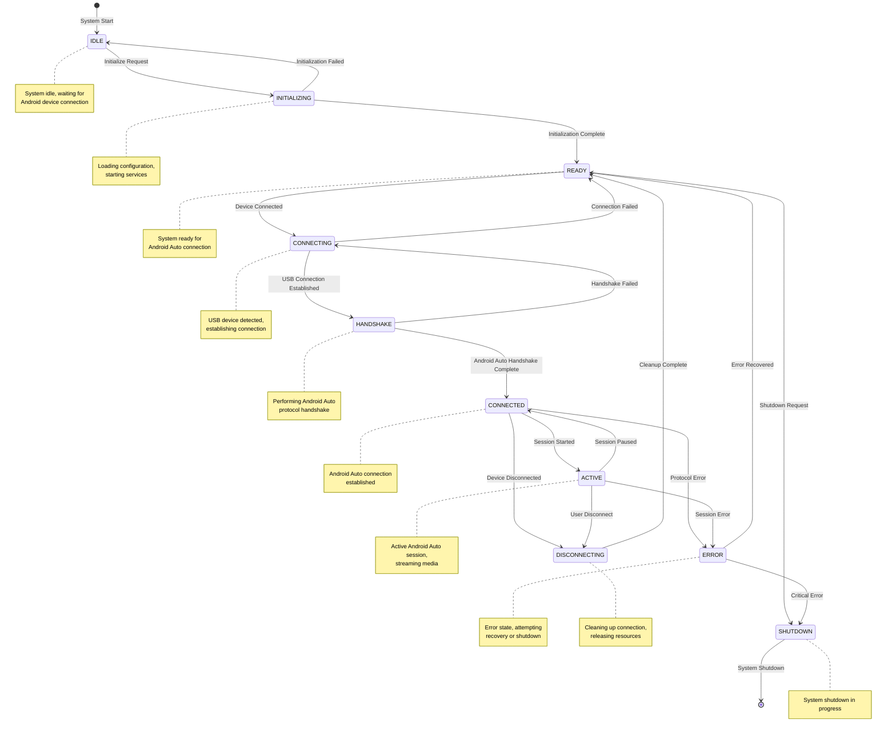

```mermaid
stateDiagram-v2
    [*] --> IDLE : System Start
    
    IDLE --> INITIALIZING : Initialize Request
    INITIALIZING --> IDLE : Initialization Failed
    INITIALIZING --> READY : Initialization Complete
    
    READY --> CONNECTING : Device Connected
    READY --> SHUTDOWN : Shutdown Request
    
    CONNECTING --> READY : Connection Failed
    CONNECTING --> HANDSHAKE : USB Connection Established
    
    HANDSHAKE --> CONNECTING : Handshake Failed
    HANDSHAKE --> CONNECTED : Android Auto Handshake Complete
    
    CONNECTED --> ACTIVE : Session Started
    CONNECTED --> DISCONNECTING : Device Disconnected
    CONNECTED --> ERROR : Protocol Error
    
    ACTIVE --> CONNECTED : Session Paused
    ACTIVE --> DISCONNECTING : User Disconnect
    ACTIVE --> ERROR : Session Error
    
    ERROR --> READY : Error Recovered
    ERROR --> SHUTDOWN : Critical Error
    
    DISCONNECTING --> READY : Cleanup Complete
    
    SHUTDOWN --> [*] : System Shutdown
    
    note right of IDLE
        System idle, waiting for 
        Android device connection
    end note
    
    note right of INITIALIZING
        Loading configuration,
        starting services
    end note
    
    note right of READY
        System ready for 
        Android Auto connection
    end note
    
    note right of CONNECTING
        USB device detected,
        establishing connection
    end note
    
    note right of HANDSHAKE
        Performing Android Auto
        protocol handshake
    end note
    
    note right of CONNECTED
        Android Auto connection
        established
    end note
    
    note right of ACTIVE
        Active Android Auto session,
        streaming media
    end note
    
    note right of ERROR
        Error state, attempting
        recovery or shutdown
    end note
    
    note right of DISCONNECTING
        Cleaning up connection,
        releasing resources
    end note
    
    note right of SHUTDOWN
        System shutdown in progress
    end note
```
