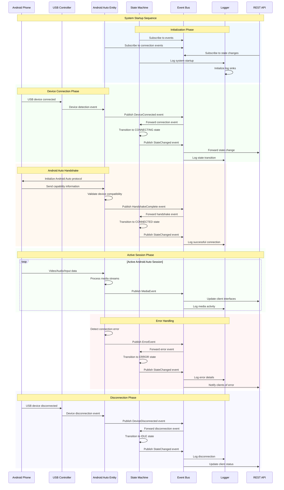

```mermaid
sequenceDiagram
    participant P as Android Phone
    participant U as USB Controller
    participant A as Android Auto Entity
    participant S as State Machine
    participant E as Event Bus
    participant L as Logger
    participant API as REST API

    Note over P,API: System Startup Sequence
    
    %% Initialization Phase
    rect rgb(240, 248, 255)
        Note over S,L: Initialization Phase
        S->>E: Subscribe to events
        A->>E: Subscribe to connection events
        API->>E: Subscribe to state changes
        S->>L: Log system startup
        L->>L: Initialize log sinks
    end
    
    %% Device Connection
    rect rgb(245, 255, 245)
        Note over P,A: Device Connection Phase
        P->>U: USB device connected
        U->>A: Device detection event
        A->>E: Publish DeviceConnected event
        E->>S: Forward connection event
        S->>S: Transition to CONNECTING state
        S->>E: Publish StateChanged event
        E->>API: Forward state change
        E->>L: Log state transition
    end
    
    %% Android Auto Handshake
    rect rgb(255, 248, 240)
        Note over P,A: Android Auto Handshake
        A->>P: Initialize Android Auto protocol
        P->>A: Send capability information
        A->>A: Validate device compatibility
        A->>E: Publish HandshakeComplete event
        E->>S: Forward handshake event
        S->>S: Transition to CONNECTED state
        S->>E: Publish StateChanged event
        E->>L: Log successful connection
    end
    
    %% Active Session
    rect rgb(248, 255, 248)
        Note over P,API: Active Session Phase
        loop Active Android Auto Session
            P->>A: Video/Audio/Input data
            A->>A: Process media streams
            A->>E: Publish MediaEvent
            E->>API: Update client interfaces
            E->>L: Log media activity
        end
    end
    
    %% Error Handling
    rect rgb(255, 245, 245)
        Note over A,L: Error Handling
        A->>A: Detect connection error
        A->>E: Publish ErrorEvent
        E->>S: Forward error event
        S->>S: Transition to ERROR state
        S->>E: Publish StateChanged event
        E->>L: Log error details
        E->>API: Notify clients of error
    end
    
    %% Disconnection
    rect rgb(248, 248, 255)
        Note over P,L: Disconnection Phase
        P->>U: USB device disconnected
        U->>A: Device disconnection event
        A->>E: Publish DeviceDisconnected event
        E->>S: Forward disconnection event
        S->>S: Transition to IDLE state
        S->>E: Publish StateChanged event
        E->>L: Log disconnection
        E->>API: Update client status
    end
```
